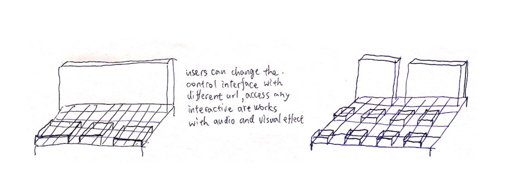

> This article is about my plan of future works in Tangible Media Group.

## 0. Content

1. [Intro: Tangible Web](#1-intro-tangible-web)
2. [My Future Research](#2-my-future-research)
   * [Tangible Security Issue](#tangible-security-issue)
   * [Audio/Visual Experiences in Web](#audiovisual-experiences-in-web)
   * [Augmented Web Pages](#augmented-web-pages)
3. [End Points](#3-end-points)
4. [Resources Needed](#4-resources-needed)
5. [Final Words](#5-final-words)

## 1. Intro: Tangible Web

One of the focuses of TMG is the vision about merging of the "Atoms" and "Bits" world. I think the first battle field would be in internet. And the webpage in WWW is the forefront of the internet world.

In my research of "Tangible Web", I want to extend the ability to experience, learn, share information physically, and create with using tangible internet.

**In my long term vision, I imagine users of "Tangible Web" can access the structured knowledge and a wide variety of "[Audio/Visual Experiences in Web](#audiovisual-experiences-in-web)" with easy-to-operate "[Augmented Web Pages](#augmented-web-pages)" physically. In the meantime,  the potential risks of security on internet are transparent to users with "[Tangible Security Issue](#tangible-security-issue)".** 

## 2. My Future Research

### Tangible Security Issue

Security in internet is important but also ignored and neglected by most of users. In my opinion, the main problem is that the sensitive informations are sent out in the abstract, digital and intangible form.

**My initial idea is to make the actions, especially when it's related to security and privacy, in browser or internets visible and tangible to the users**. This project make internet presence, privacy, and security, have clear repercussions of those actions.

One may have to press a physical, huge and red and button to use your credit cards, register accounts and send emails with sensitive contents. A physical interactive light would blinks every time your computer want to uses the NIC (Network Interface Card) to send something and you can stop it by simply touch the light (more details about this in the image below).

### Audio/Visual Experiences in Web

> The image above is the web page view in Beact. The rectangles in the background are clickable to users. I want to use TRANSFORM to make them come true!

**To extend the musical and visual experience in the web, I want to create dynamic shared internet-based physical instruments.**

This idea is based on my previous work [Beact](/projects/beact/). Beact is a interactive webpage that everyone can play with to become a DJ + VJ in few seconds. It is also an instrument combining the concept of drum machine and keyboard.

I am really interested in transforming the current webpage interaction into tangible interfaces.  I want to use TRANSFORM as the interface and construct the interactive blocks in the webpage on to it. Also, I might add some curtain layer on the top to make the projection more smooth on the surface.

**First, the system developed can be used in the physical demostration of a wide variety of research, projects, and art works shared via internet.**

Besides, This opens a design space for musical instrument which can be shared with internet easily. Also, because it can empower the interactive art works involving visual and musical effects to be distributed through internet, net art will no longer be confined in the monitors.

### Augmented Web Pages
WWW is definitely the most important source of knowledge in 21st century. I spend huge amount of time using browser to do a wide variety of things. However, the structure of pages and tabs are still similar to 20 years ago.

I always suffer from navigating through dozens of tabs in my browser. People usually keep opening new tabs because the  essence in information on internet is diverse and  structured in hyperlinks. I often read several pages at one time and compare the contents to each other. It can only be achieved by arranging them in the monitor(s) and switch frequently if you need more than four pages.

One of my ideas is to enhance the experience of browsing by imitating some office tools which were powerful during early days, such as physical papers and sticky notes.

First, **I want to make comparitive reading more easy in browser**. I'll prototype a sofware used in computer and tablets to manage the web pages just like physical papers. User can move the pages and "flip" the pages by certain gestures just like the real papers. Furtheromore, the software will make a relation graph based on the content and hyperlinks in the pages to help user understand the underlying structure. The virtual sticky notes can store a whole session and relation graph, so they could help users continue the unfinished reading and learning memory.

At this stage, I want to use software to conceptualize the idea, but I imagine about the using of augmented sticky notes, pens and papers in the future. I can spread the pages on my desktop to compare and switch between them by simply turn to the backside and read, note the importance with pen, and bookmark them with sticky notes. All of the actions taken would be traced by the digital essence of the tools and managed easily in computers.

These ideas make the abilities we learned from physical world be useful in digital world, and help people construct a better understanding to the structure of knowledges on internet.

## 3. End Points

> **The projects and ideas above may not be solid enough to implement yet, but this doesn't deviate my vision towards the end points.**

Web is the universal, open media to almost anyone with internet, despite some concerns about accessibility and net neutrality etc. As a developer, I am always fascinated by the magic emerging from the mystery world of web and fully awared of the risks of privacy and security issues around us.

Therefore, I want to ...
1. make security issues clearly visible to the user and make their actions related to security fully awared by the dynamically changing size and affordances of the tangible object. ([Tangible Security Issue](#tangible-security-issue))
2. make the hidden data flow and musical/visual experience more accessible to people with little knowledge of how the browser or internet is working. ([Tangible Security Issue](#tangible-security-issue), [Audio/Visual Experiences in Web](#audiovisual-experiences-in-web))
3. make the physical demonstration (incluing research outcomes, interactive projects, and art works) involving audio/visual effects more easily implemented and shared via internet. ([Audio/Visual Experiences in Web](#audiovisual-experiences-in-web))
4. use the methods of interacting with objects in physical world to manipulate the structure of knowledge on internet, and extend the abilities we learned from physical world when  be useful in digital world. ([Augmented Web Pages](#augmented-web-pages))

## 4. Resources Needed

### In The Lab
I might need few things to implement the ideas
1. different computers with multiple OS to test the cross-platform compatibility.
2. the model of TRANSFORM to implement the connection with internet.
3. 3d printing for prototype of the interface and physical objects.

### Communities
To make the projects meet the need of the future, I will have to consult the organizations that care about the problems and future of internet, such as [Internet Society](https://www.internetsociety.org).

### Conferences
Also, I will need to pay attention to the fast-pace web technology to make the research and projects of mine more realistic. Conferences like [WEBIST](http://www.webist.org/CallForPapers.aspx#A5) and [Web Intelligence](https://webintelligence2018.com/), are important resources for my further plan. Besides, my ideas are related to user interface, so I would also like to  attend [UIST](http://uist.acm.org/uist2018/) and [CHI](https://chi2018.acm.org).

## 5. Final Words

I really appreciate this opportunity, and want to present the best of me to you. I hope this document help me clarify some parts of my future works.

##### Vibert Thio , 2018/01/23
