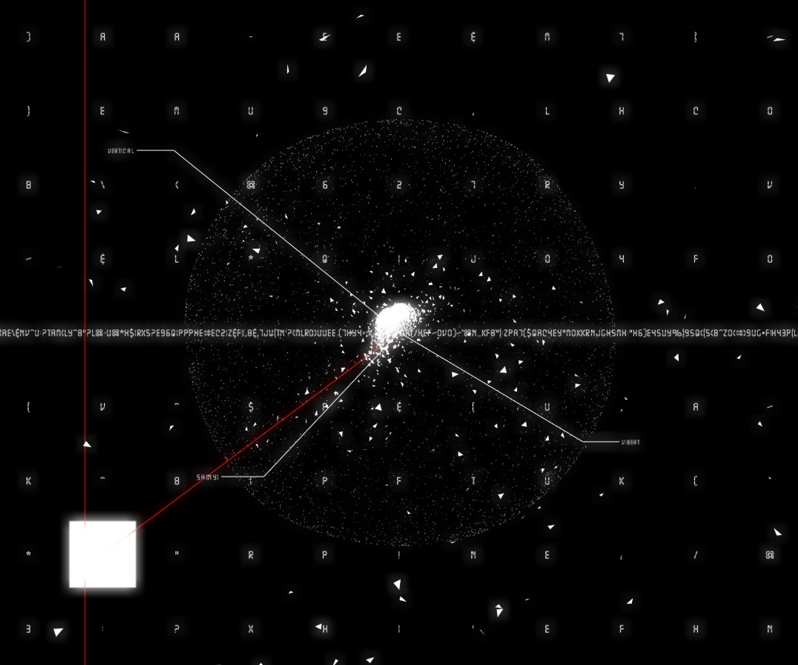
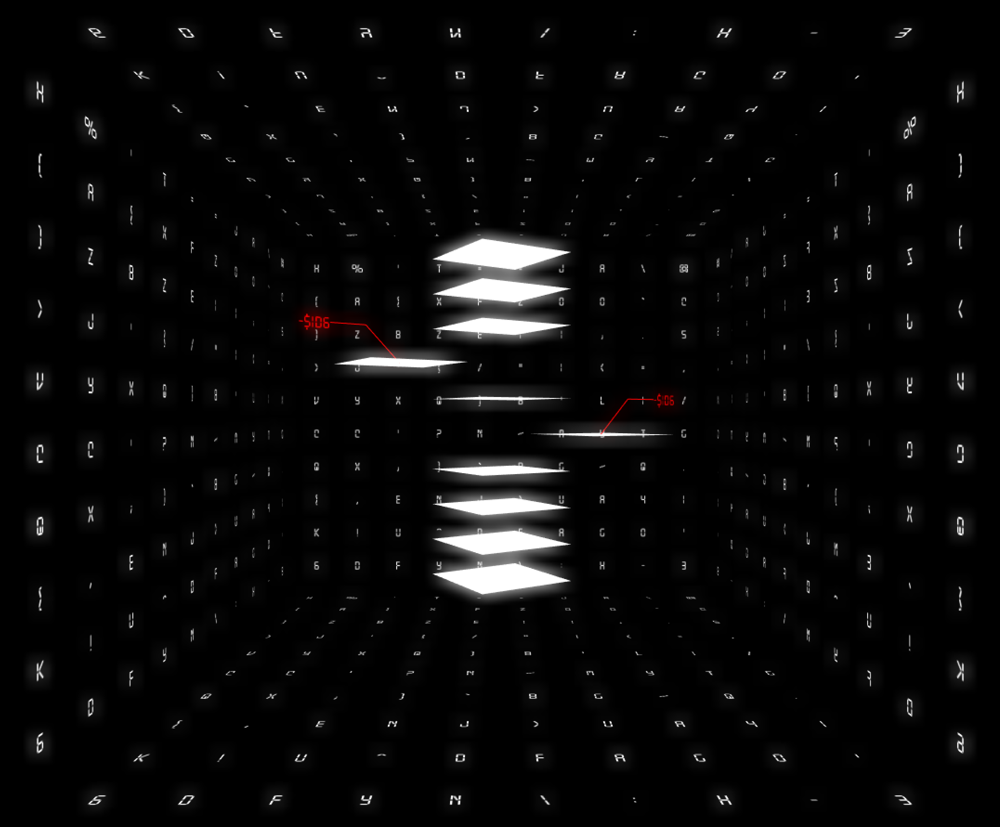
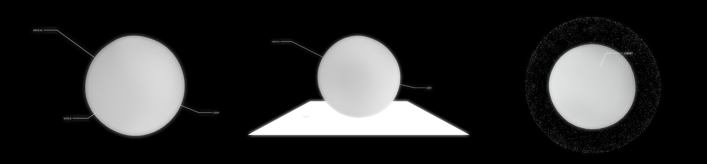

> 2018.4 – 2018.9

##About

Those lo-fi videos are stored in the black digital cassettes, which is essentially the combination of 0/1 in specific format. Though DCR-TRV30 is only a technological prosthesis as extension of human capability of memory. One day, it found that its hardware embedded algorithm, which is interpreting the video format, had something wrong. It thought that maybe it’s the rust on ROM (Read Only Memory) to blame.

DCR-TRV30 tried to replay the cassettes, gazing through its tiny optical lens. The original images were gone. In the beginning, the only thing left is a glowing white frame. It started glittering and was seemed trying to tell a different story. They are recorded by DCR-TRV30 itself, and it felt …

##Links

[> The exhibition: Chromesthesia][1]  
[> Source Code][2]  

[1]: http://artemperor.tw/tidbits/7797
[2]: https://github.com/vibertthio/digital-cortex
