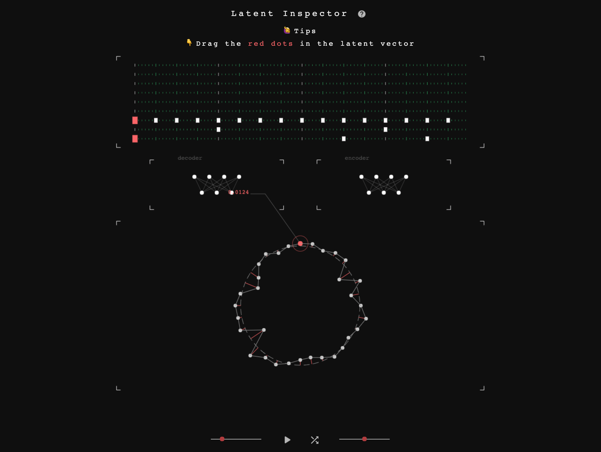

> 2018.12 - now

##About

It’s an interactive web demo based on an VAE model of drum patterns. It visualize the relation of latent vectors and drum patterns in the VAE. The upper half shows the drum patterns with 9 drum samples (kick/snare/open hi-hat/closed hi-hat/low tom/mid tom/hi tom/ride/cymbal). The middle is the pseudo encoder/decoder visualization. And, the lower is an adjustable 32-dims latent vector visualized by a circular diagram.

The player can modify any dimension in the latent vector to see how it affect the drum pattern, through the decoder. Also, the latent vector will change responsively when the drum notes are added/removed.

Besides the idea of visualization, I am also developed this based on another thought. What musicians need may not be only a particular feature (like interpolation) of musical machine learning, or well-organized function, but also some unknown possibilities. As David Bowie said, it would be much more interesting when the musician have no idea what the knobs are designed for on a synthesizer. Every dimension in the latent vector is similar to the knobs on a synthesizer, and it will produce some melodies/drum variation that might be interesting.

 

##Links

[> Play It](http://vibertthio.com/drum-vae-client/public/) 
[> Source Code](https://github.com/vibertthio/drum-vae-client)
