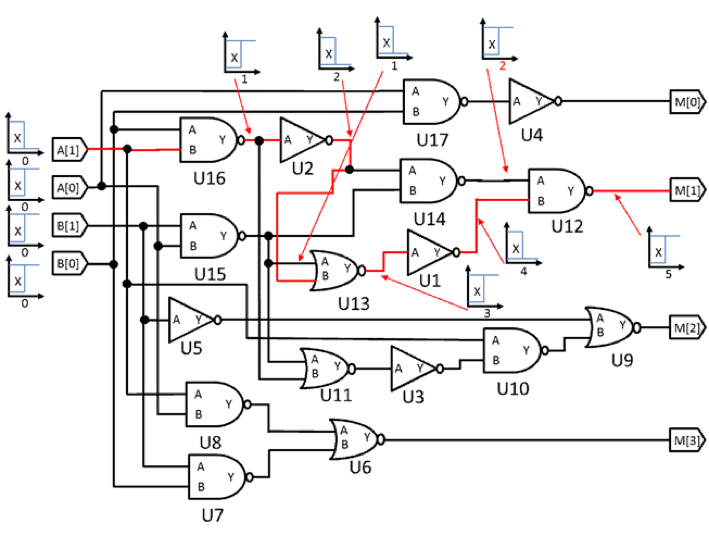

> 2015.12 – 2016.7

#####We presented a implementation of static timing Analysis (STA) on digital circuit. The better STA algorithm, the greater efficiency of VLSI design flow.

##Introduction

The maximum operational frequency of a circuit is determined by the maximum propagation delay its combinational parts, which is defined by the longest delay it takes for a signal to propagate from an input to an output. We call the path of this propagation “critical path”.

##Static Timing Analysis (STA)
STA is a critical procedure of IC design. It can report critical paths, and check all timing violations. It’s used by designers to determine whether the timing requirements of a design are met. Faster STA can help accelerate the design of VLSI (Very Large Scale IC).

The input of an STA program is a Verilog gate-level netlist whereas the output will be a list of “true paths”. A true path is whose output node will be changed due to the input node, and a false path is whose will not.

*The awarding ceremony of 2016 CAD Contest at ICCAD.*

##“Implication” and “Justification”
The process can be separated into two parts: implication and justification.

The algorithm we used for implication is based on the paper proposed by R. Peset Llopis [1]. However, the algorithm of “Justification” was designed and implemented by ourselves.

“Implication” is using the status of a connection wire in a specific period of time to deduce the status of other wires connected to the same gate. Thereafter, it would determine whether each path is a potential true path or 100% false path.

*This graph above shows an example of determination of a true path.*

“Justification” is straightforward try-and-error. First, the program guesses what value of a specific gate is. Secondly, it uses the analysis of time in “Implication” and verify the guessing. It always starts with the primary inputs, and deduce the status of whole circuit. If any conflict is encountered, it will backtrack the procedure and try different inputs until all possible input vectors are tried. The path is true if more than one input vector is found to justify it. Otherwise, it’s a false path.

##Result

Our program was capable of finding the true paths in cases with under 500 gates within seconds. Moreover, it could resolve the case with 1145 gates, 20 inputs, 20 outputs within 2 hours. It was the second fastest one in the 2016 CAD Contest at ICCAD.

##Teamwork

We were a 3-person team. I’m charge of designing the algorithm of “justification” and its implementation, a portion of implementation of “implication”. We allotted the analysis to each one evenly.

##Links

[> Problem Description][1]  
[> Analysis Report][2]  

[1]: http://cad-contest-2016.el.cycu.edu.tw/Problem_D/default.html
[2]: https://drive.google.com/file/d/0ByNwzf7aYOQ3VHhSejlSdGduZjg/view
