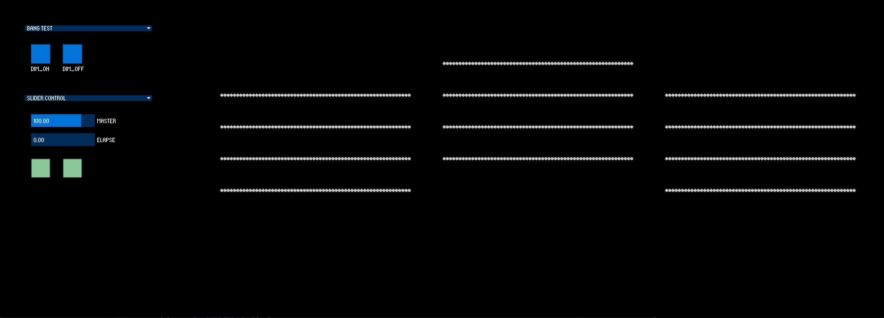

> 2017.3 – 2017.5

#####It's a collaboration with  [Asking Gee](https://askinggee.wixsite.com/agworks/videos) . It is her performance using interactive lighting installation controlling system.

 

<iframe src="https://player.vimeo.com/video/222569600" width="640" height="360" frameborder="0" webkitallowfullscreen mozallowfullscreen allowfullscreen></iframe>

<a href="https://vimeo.com/222569600">TRAIL | Interactive Lighting Installation LIVE show vol.2</a> from <a href="https://vimeo.com/askinggee">Asking Gee</a> on <a href="https://vimeo.com">Vimeo</a>.

##About
“Trail” is a live show with interactive light installation produced by Asking Gee. I was in charge of the designing of the software light system and controlling interface.

 

*The controlling interface of “Trail”*

##Links

[> Asking Gee][1]  
[> Source Code][2]  

[1]: https://askinggee.wixsite.com/agworks
[2]: https://github.com/vibertthio/trail-light-system
