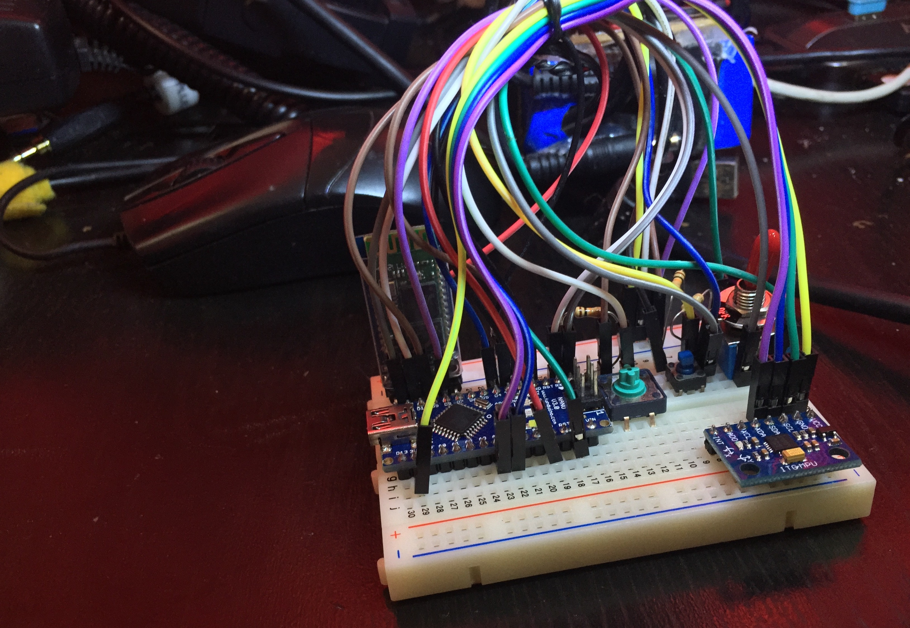
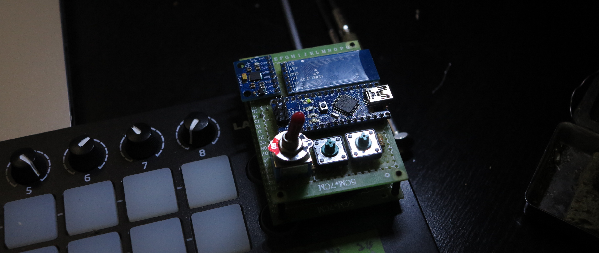
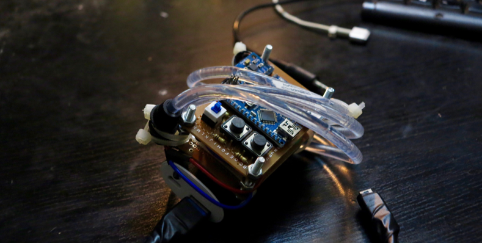

> 2017.7

#####Self-made experimental electrical instruments, combining percussion with continuous synth.

 

<iframe src="https://player.vimeo.com/video/240780843" width="640" height="360" frameborder="0" webkitallowfullscreen mozallowfullscreen allowfullscreen></iframe>

<a href="https://vimeo.com/240780843">WhipWhip | Self-Made Musical Instrument with Optic Fiber</a> from <a href="https://vimeo.com/user56788864">Vibert Thio</a> on <a href="https://vimeo.com">Vimeo</a>.

##About

*Iang Tu and I used “WhipWhip” in our live set. (2017.9)*

 

Inspired by the artist Onyx Ashanti, who exploring a new path of performance, I want to make an instrument which can detect my gesture and be the lighting device at the same time. I use Arduino as the MCU, optical fiber as light, 6-axis gyroscope as sensor, and Bluetooth protocol to communicate.

 

*The prototype of WhipWhip on bread board. (2017.7)*

 

*The final version on bakelite board. (2017.8)*

 

##Links
[> Iang Tu][1]

[1]: https://soundcloud.com/duanger

 
