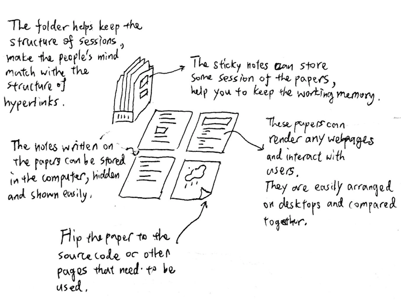
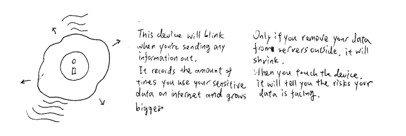

> This article is about my plan of future works in Tangible Media Group.

## 1. Intro: Tangible Web

One of the focuses of TGM is the vision about merging of the physical and digital world. I think the first battle field would be in internet. And the webpage in WWW is the forefront of the internet world.

I want to do research about how to extend the experience which I valued the most  in browser and webpages (including music, visual effects, browsing and security) utilizing tangible interfaces.

## 2. My Future Research

### .Musical Experiences in Web

> The image above is the web page view in Beact. The rectangles in the background are clickable to users. I want to use TRANSFORM the make them come true!

One of my idea is based on my previous work [Beact](https://vibertthio.com/portfolio/projects/beact/). Beact is a interactive webpage that everyone can play with to become a DJ + VJ in few seconds. It is also an instrument combining the concept of drum machine and keyboard.

I am really interested in transforming the current webpage interaction into tangible interfaces like TRANSFORM.  I will use TRANSFORM as the interface and construct the interactive blocks in the webpage on to it. Also, I want add some curtain layer on the top to make the projection more smooth on the surface.

This opens a design space for musical instrument which can be shared with internet easily. Moreover, it can empower the interactive art works involving visual and musical effects to be distributed through internet. The net art will no longer be confined in the monitors.

### .Tabs and Pages
WWW is definitely the most important source of knowledge in 21st century. I spend huge amount of time using browser to do a wide variety of things. However, the structure of pages and tabs are still similar to 20 years ago.

I always suffer from navigating through dozens of tabs in my browser. People usually keep opening new tabs because the  essence in information in web is diverse and  structured in hyperlinks.

One of my ideas is to enhance the experience of browsing by imitating some office tools which were powerful during early days. I often read several pages at one time and compare the contents to each other. It can only be achieved by arranging them in the monitor(s) and switch frequently if you need more than four pages.

I imagine about the using of augmented sticky notes, pens and papers in this scenario. I can spread the pages on my desktop to compare and switch between them by simply turn to the backside and read, note the importance with pen, and bookmark them with sticky notes. All of the actions taken would be traced by the digital essence of the tools and managed easily in computers.

These ideas make the abilities we learned from physical world be useful in digital world, and help people construct a better understanding to the structure of knowledges on internet.

### .Tangible Security Issue
Security int internet is important but also ignored and neglected by most of users. In my opinion, the main problem is that the sensitive informations are sent out in the abstract, digital and intangible form.

My initial idea is to make the actions in browser or internets visible and tangible to the users. One may have to press a physical, huge and red and button to use your credit cards, register accounts and send emails with sensitive contents. A physical interactive light would blinks every time your computer want to uses the NIC (Network Interface Card) to send something and you can stop it by simply touch the light.

## 3. End Points

> **The projects and ideas above may not be solid enough to implement yet, but this doesn't deviate my vision towards the end points.**

Web is the universal, open media to almost anyone with internet, despite some concerns about accessibility and net neutrality etc. As a developer, I am always fascinated by the magic emerging from the mystery world of web.

Therefore, I want to ...
1. make those kinds of amazement more accessible to people with little knowledge of how the browser or internet is working.
2. help people construct a better understanding to the structure of knowledges on internet and make the abilities we learned from physical world be useful in digital world.
3. eliminate the negligence of security issue on internet by making the procedure tangible.

## 4. Resources Needed

### .In The Lab ...
I might need few things to implement the ideas
1. different hardware to test the cross-platform compatibility.
2. 3d printing for prototype of the interface and physical objects.
3. crazy people to discuss the scenarios and get inspired!

### .Communities
To make the projects meet the need of the future, I will have to consult the organizations that care about the problems and future of internet, such as [Internet Society](https://www.internetsociety.org).

### .Conferences
Also, I will need to pay attention to the fast-pace web technology to make the research and projects of mine more realistic. Conferences like [WEBIST](http://www.webist.org/CallForPapers.aspx#A5) and [Web Intelligence](https://webintelligence2018.com/), are important resources for my further plan.

## 5. Final Words
I really appreciate this opportunity, and want to present the best of me to you. I hope this document help me clarify some parts of my future works.

##### Vibert Thio , 2018/01/23
