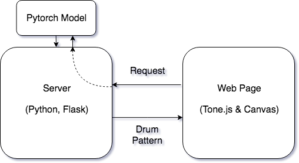
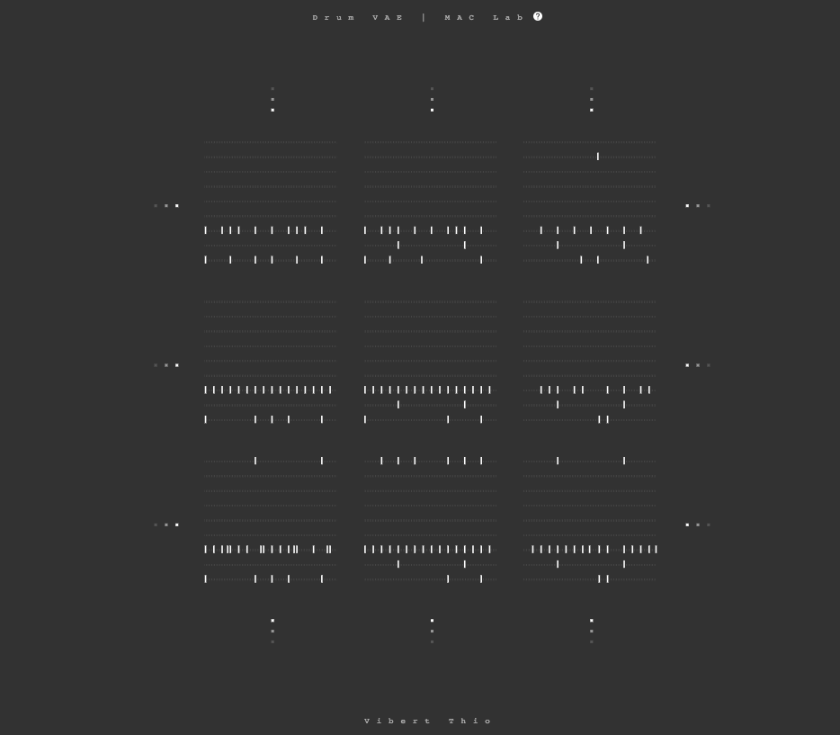

> 簡單介紹目前 Drum VAE 專案的進度

## 1. Intro 前言

> [demo website](http://vibertthio.com/drum-vae-client-template/)

在看到 Magenta 的專案 MusicVAE 之後，我認為針對 Drum Pattern Generation Model 會是一個好的起始點。鼓的結構重複性高所以相對單純，目標設定在較短的結構開始（例如一到四個小節的長度），我猜想這樣的資料性質會讓各種 Generative Model 更容易抓到其內在的邏輯／性質。模型方向選定的是 VAE，希望能夠跟 MusicVAE 進行一些比較。

另外一個重要的考量就是關於網站展示。在剛進實驗室時就有想過要利用 Web 當作媒介來讓別人更容易接觸現在 MAC Lab 在音樂機器學習裡面的成果，除了透過跟模型互動讓其他人更容易了解以外，也可以讓研究者更容易跟別人介紹自己的結果。若是建立起一套簡單、快速的系統，甚至直接的試驗一個模型各方面的效果。考慮到網頁前端展示的效果，利用鼓機的方式呈現也讓介面的互動性非常簡易，基本的功能只要單純的點擊就可以實現，例如開啟不同的節奏 pattern，或是在 VAE 的 latent space 裡面移動。而且之前已經有寫過網頁鼓機的經驗，只要將原本的結構加上後端的 server 和 model 就可以完成。

## 2. Model Training 模型訓練
我使用的是 LPD 當作 dataset，前處理包括將有意義的片段取出、刪除音符過於稀少的資料，並將原本 84 個音高降低到只剩下 9 個音高，使用的方法是將鼓的音色歸類到主要的 9 種裡面（Kick、Snare、Open Hi-hat、Closed Hi-hat、 Low Tom、Mid Tom、High Tom、Crash、Cymbal）。會這樣處理的原因除了因為比較好 train 起來之外，就是降低整個資料的大小。最後處理完的量大約是有 300,000 個小節的資料，包含電子、搖滾、流行等十三種樂風（根據皓文提供的 tag list）。

VAE 的架構中使用 GRU 所建構的 RNN，在 decoder 和 encoder 上面都有。選取 latent space 的維度為 32，是測試過效果最佳。維度太高的話會使得 encoder 在 latent space 的 output 分佈太過於分散，空洞的狀態會造成中間的地方 decode 會不像是真正的節奏。相反的，太低則會使得 reconstruction 的效果不佳。

## 3. Website Architecture 網站架構
這次小專案的最主要目的是要嘗試整套系統的建立，除了模型訓練之外，還包括如何建立 web server（後端 backend）與網頁（前端 frontend）。這次的架構非常簡單：在後端方面，使用一個 Python 建立的 server（使用 Flask 為 Framework）並將使用 Pytorch 訓練好的 model 放進去，在 193 上面開啟一個連接的 http port；另外在前端，採用基本的 React 加上 canvas 建立 UI，使用Tone.js 處理聲音的邏輯。最後就是由前端發一個 request 給後端，要求它時產生某個 latent vector 相應的 drum pattern 回傳，並由前端 render 畫面。

## 4.  Usage 使用方法
進入畫面會看到 9 個不同的 drum pattern，每個都是由 96 個 timestep 組成一個小節，並且有九個不同的 track（代表大鼓、小鼓等）。中間的是一個隨機從 dataset 找出來的資料，也就是一個真實存在的 drum pattern，而旁邊的九宮格則是代表從 latent space 任意挑出來的兩個維度上的變化結果。換句話說，就是把中間資料點的 latent vector 對 32 個維度中的兩個進行些微的調變，再送到 Decoder 而得到的結果。預設會直接播最中間的節奏，可以透過滑鼠點擊啟動任意一個節奏。

####  1. 滑鼠點擊
切換九種裡面的不同節奏，藉以觀察 latent space 中移動對於節奏造成的影響。舉例來說，有些維度可能會造成節奏的密度增加，也有可能會造成 shuffle 的效果。

#### 2. 按鍵盤 “←, →, ↑, ↓”
使中央節奏的 latent vector 沿著兩個選出來的維度進行移動。

#### 3. 按鍵盤 “c”
切換 latent space 變化的維度（隨機在 32 個裡面挑出兩種，若想要知道目前是哪兩種可以開 console 看）。

#### 4. 按鍵盤 “r”
隨機切換中心點 latent vector 位置到 latent space 中其他的地方（會維持旁邊變化的維度）。

## 5. Discussion 延伸與討論
這個作品目前的意義可以從它跟 Magenta 的 MusicVAE 之間的比較來看起：首先，這是一個非小的 codebase。相對於 Magenta 是一個非常完整並且多功能的專案，包裝成一整個 JavaScript 的 library 也造成不容易閱讀。所以這個 Drum VAE 非常好學習跟參考。再來，整個網頁應用的架構也很單純，其他人可以把其中使用的 model 直接換掉加上修改一點點 API 就可以使用。最後是雖然目前的使用介面跟 Magenta 周邊的應用大致上類似，但是可以修改的彈性很高，之後也會加進一些更有用的資訊與有趣的互動。像是目前使用時，會不知道到底中心點在 latent space 的什麼位置，皓文建議可以可以加一個更廣範圍的 map 當作指引。

另外，若玩一下子就可以發現，若是在 latent space 裡面移動久了，就會遇到其中 decode 出來不像是真正節奏的地方。因此，之後可能會嘗試放上其他 model 來比較，或是降低 timestep 的數量、增加小節數等實驗。